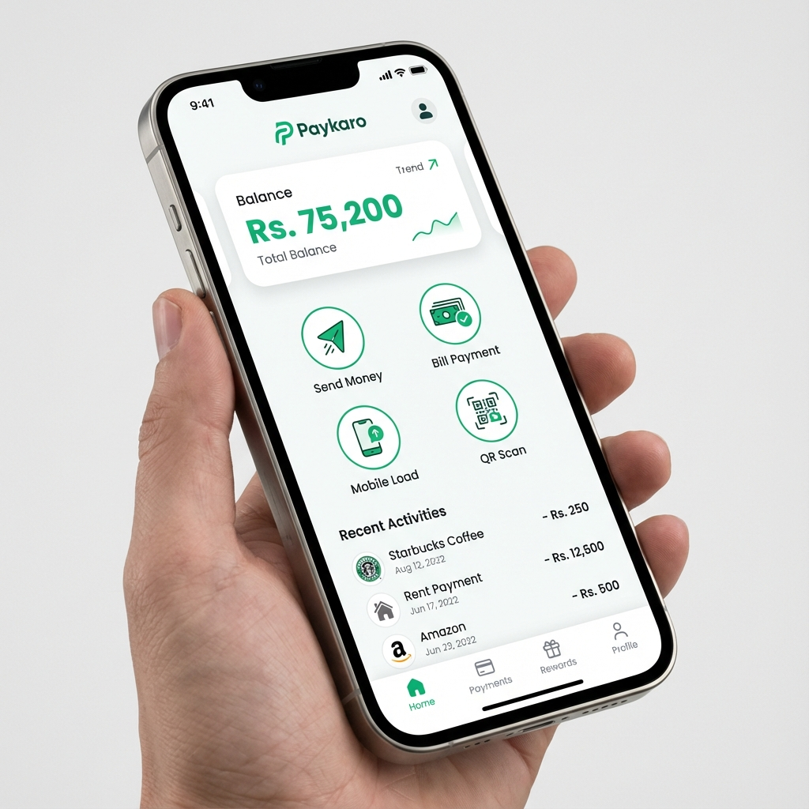
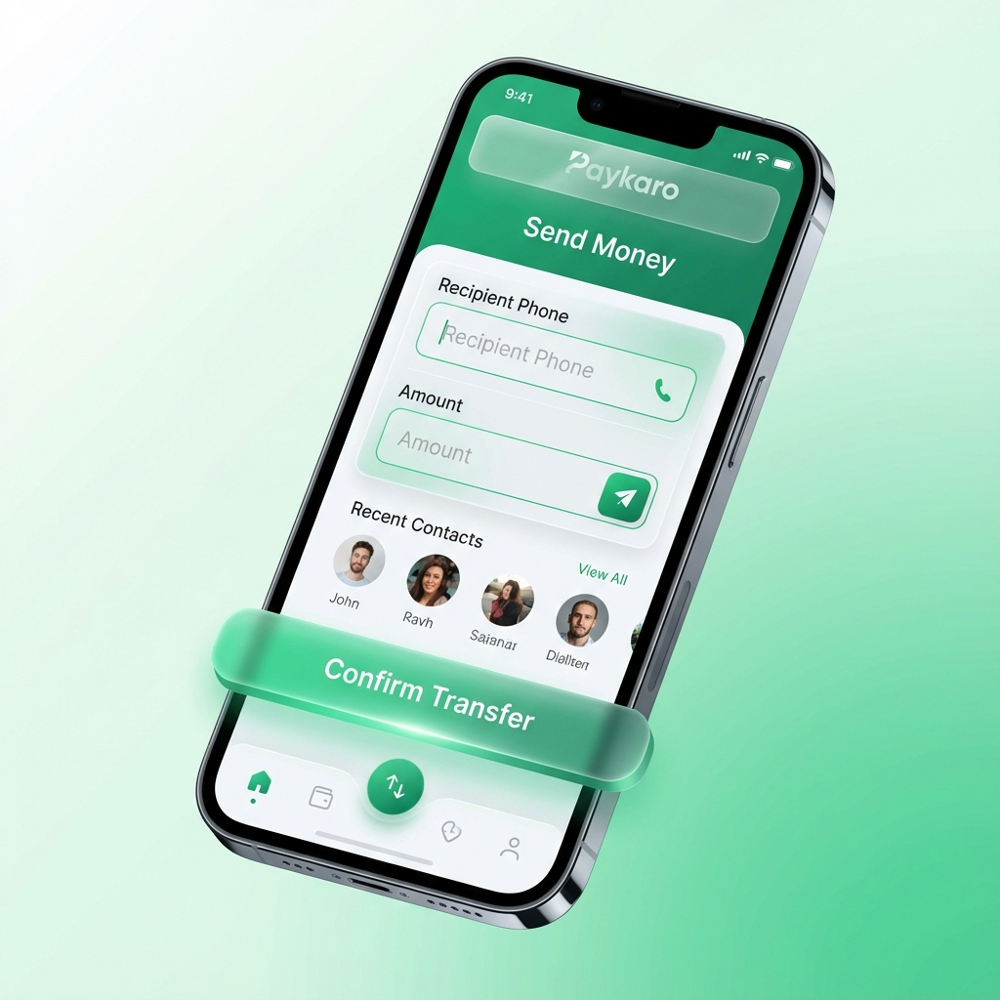

# Paykaro: Real-Time Fintech Platform


Paykaro is a comprehensive, production-grade fintech platform built for high-scale financial transactions and real-time big data analytics. It features a stunning, "White & Green" premium mobile experience integrated with an event-driven microservices backend.

## ✨ Features

### 📱 Premium Mobile App
- **Seamless Edge-to-Edge Design**: Immerse users with a UI that flows perfectly behind the status bar and device notches.
- **P2P Transfers**: Perform real-time peer-to-peer money transfers with instant balance updates.
- **Fintech Ecosystem**: Includes Bill Payments, Mobile Top-ups, QR Scanners, and interactive Account Management.
- **Security First**: JWT-based authentication combined with secure 4-digit transaction PINs.

### ⚙️ Scalable Backend & Big Data
- **Real-Time Pipeline**: Every transaction is streamed through **Apache Kafka** for immediate processing.
- **Analytics Engine**: **Apache Spark** performs multi-layer processing (Bronze → Silver → Gold) for fraud detection and spending insights.
- **Distributed Cache**: **Redis** provides lightning-fast access to live activity and caching for frequent operations.
- **Persistent Storage**: Robust **PostgreSQL** database ensuring ACID compliance for every financial record.

## 🏗️ Technical Stack

- **Mobile**: React Native, Expo, Material Community Icons.
- **Backend**: FastAPI (Python), SQLAlchemy, JWT, Pydantic.
- **Streaming**: Apache Kafka, Zookeeper.
- **Processing**: Apache Spark (Streaming & Batch), Delta Lake.
- **Storage**: PostgreSQL, Redis.
- **Infrastructure**: Docker, Docker Compose, Terraform (AWS).

## 🚀 Getting Started

### Prerequisites
- Docker Desktop
- Node.js & Expo Go
- Python 3.10+

### 1. Launch the Backend (Docker)
```powershell
docker-compose up --build -d
```

### 2. Launch the Mobile App
```powershell
cd paykaro
npm install
npx expo start
```

## 📸 Screenshots

````carousel

<!-- slide -->

<!-- slide -->

````

## 🛡️ Fraud Detection & Gold Layer
The Spark Gold layer performs advanced analytics on the silver transaction data:
- **Aggregates**: Daily volume and transaction frequency per user.
- **Fraud Features**: Identifying unusual spikes in transaction amounts (> Rs. 50,000) and suspicious geographic activity.

---
Built with ❤️ by the Paykaro Team.
